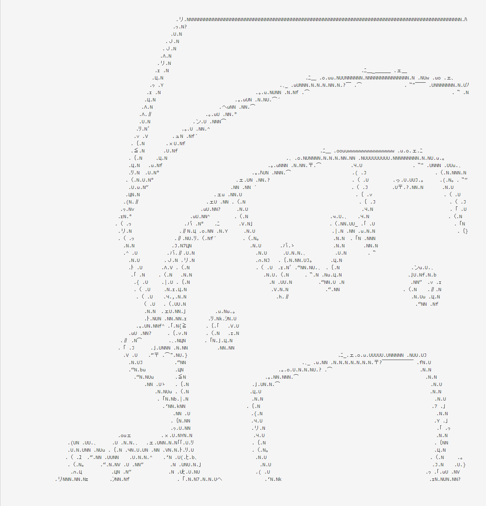

# AsciiArt-Converter

画像をAA化するwebサービスです． 
精度がよく，等幅フォントでアスキーアートを作成してくれるツールが見当たらなかったので作成しました．

# フレームワーク
Play Framework 2.5.1 + Java 8

# 構成
リバースプロキシサーバ...Nginx 
アプリケーションサーバ...Netty Server x2

# 変換アルゴリズム
+ ラプラシアンフィルタで輪郭抽出
+ ノイズ除去
+ aa変換 

変換例 

